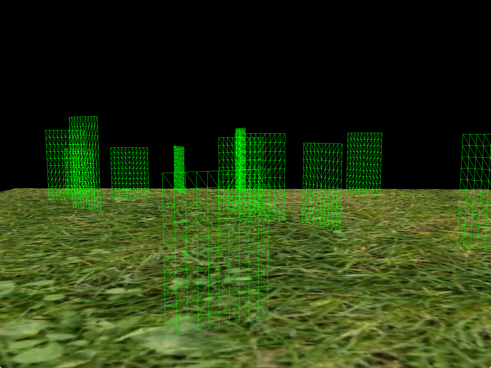
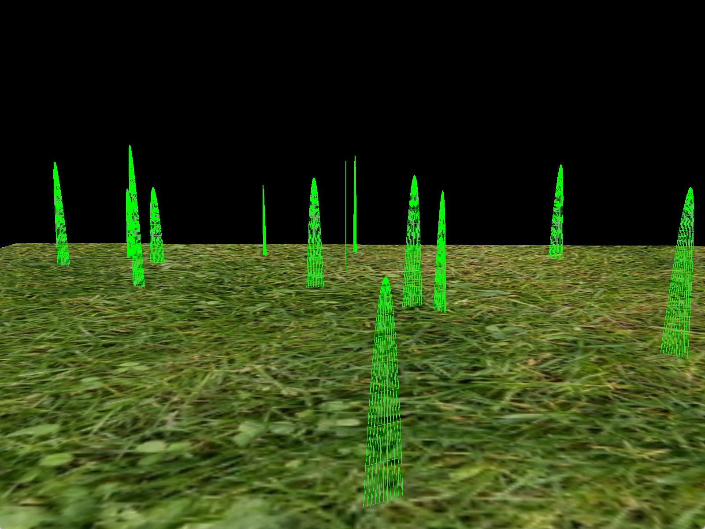
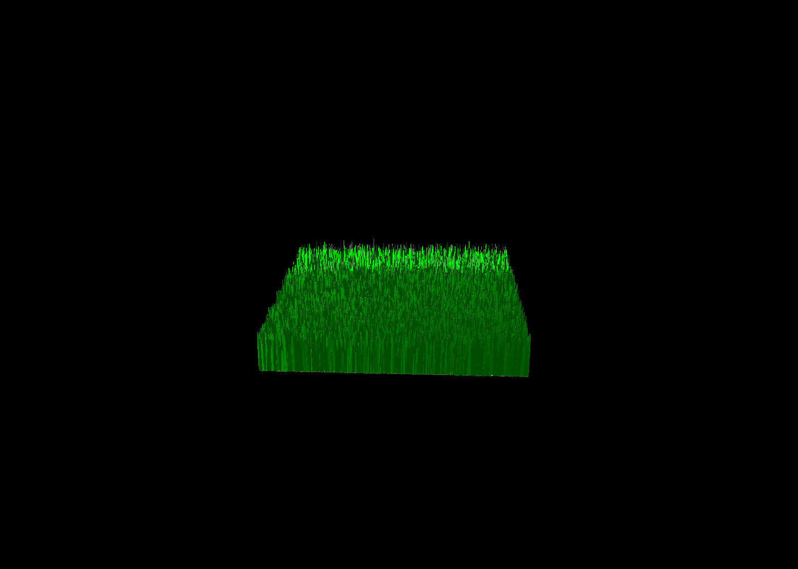
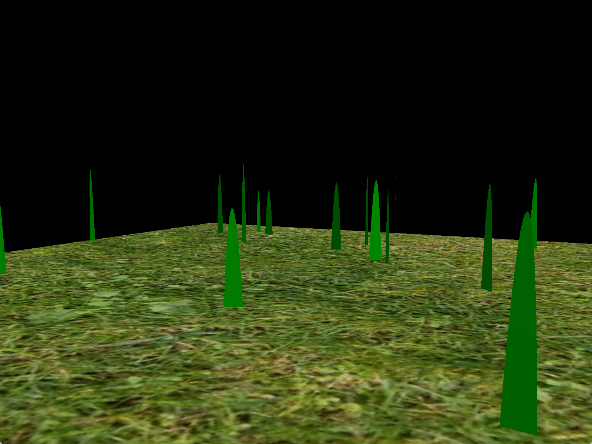
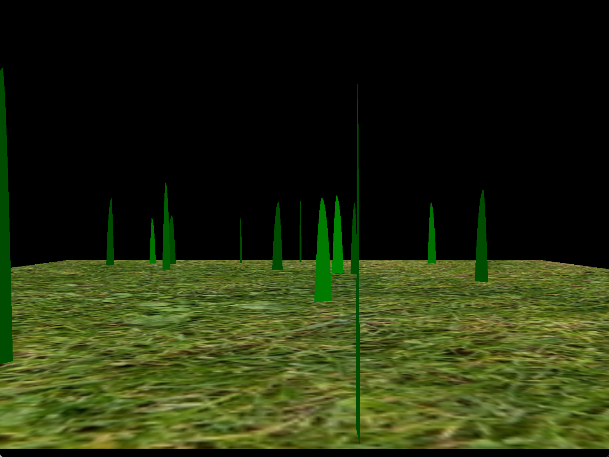
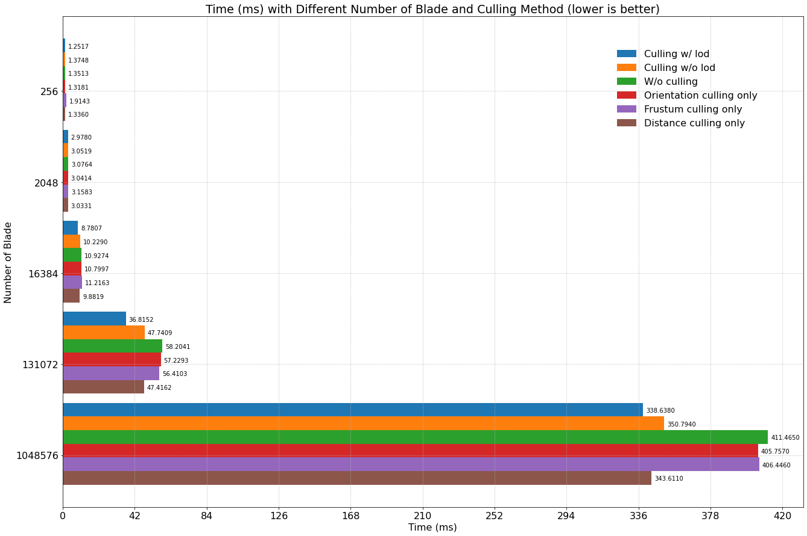

Vulkan Grass Rendering
==================================

**University of Pennsylvania, CIS 565: GPU Programming and Architecture, Project 5**

* Gehan Zheng
  * [LinkedIn](https://www.linkedin.com/in/gehan-zheng-05877b24a/), [personal website](https://grahamzen.github.io/).
* Tested on: Windows 11, AMD Ryzen 7 5800H @ 3.2GHz 16GB, GeForce RTX 3060 Laptop 6144MB (Personal Laptop)

## Overview

This project is an implementation of the paper [Responsive Real-Time Grass Rendering for General 3D Scenes](https://www.cg.tuwien.ac.at/research/publications/2017/JAHRMANN-2017-RRTG/JAHRMANN-2017-RRTG-draft.pdf). Grass is represented by Bezier curves and rendered using tessellation. The grass is simulated using a simple wind model. 

The following features are implemented in this project:

- Tessellation: quad patches remapped to Bezier curves
- Grass rendering: lambertian shading
- Simulation: gravity, recovery, and wind

## Features

### Tessellation

Tesellation stages are implemented in `grass.tesc` and `grass.tese`, which are after the vertex shader and before the fragment shader. We are using quad patches (which is specified in the `grass.tese` file's `layout` section), so we assign tessellation levels to two inner edges and four outer edges of the quad. 

In the `grass.tese` file, we have `u`, `v` of each vertex in the quad.
We first compute the position of the vertex within the Bezier curve with corresponding `v` using De Casteljau's algorithm, and then move two vertices along the direction of the grass blade by width. The position of each vertex can be computed by interpolating the position of the two vertices with a weight interpolated from `u` to 0.5 by `v` (this is because when `v` is closer to 1, the distance between the vertices corresponding to `v` is closer). The following image shows the process of computing the position of a vertex in the quad by setting rasterization `polygonMode` to `VK_POLYGON_MODE_LINE` (by default it is `VK_POLYGON_MODE_FILL`).

| Generated patch | Remapped patch |
| ----------------| -------------- |
|  |  |

### Dynamic tessellation level

The tessellation level is computed by the distance between the camera and the grass blade. When the distance is larger than a threshold, the tessellation level is set to 1, and when the distance is smaller than the threshold, the tessellation level is set to 10. From the following image, we can see that the grass blade with a larger distance has a lower tessellation level and has a different color.

### Rendering

I defined a point light above the grass and use lambertian shading to render the grass. 

### Simulation

#### Forces

Gravity, Recovery, and Wind are implemented in the simulation. 

##### Gravity only

https://github.com/GrahamZen/Project5-Vulkan-Grass-Rendering/assets/31180310/93f38286-d466-4b82-9077-4f39372a6fd9

##### Recovery added

##### Wind added 

I used a simple wind model that the wind is blowing from a fixed direction and the wind speed is a sinusoidal function of time.

https://github.com/GrahamZen/Project5-Vulkan-Grass-Rendering/assets/31180310/598bbc32-18c1-4fb2-939a-2c66390f535f

#### Culling

Three culling methods are implemented in this project: orientation culling, view-frustum culling, and distance culling.

##### Orientation culling

https://github.com/GrahamZen/Project5-Vulkan-Grass-Rendering/assets/31180310/9d3a5725-e416-4678-a0b4-6417d3c20eb3

##### View-frustum culling

The grass blade is culled if v0, v2, and m are all outside the view frustum, where `m = (1/4)v0 * (1/2)v1 * (1/4)v2`.

https://github.com/GrahamZen/Project5-Vulkan-Grass-Rendering/assets/31180310/e3b8ddb5-129b-4e02-ae29-7721032f71b6

##### Distance culling

https://github.com/GrahamZen/Project5-Vulkan-Grass-Rendering/assets/31180310/ff399173-22b6-4352-b4a7-7dac4c686dfe

## Performance Analysis

The following graph shows that the performance of the program is almost linearly dependent on the number of grass blades when the number of grass blades is large, which is not the case when the number of grass blades is small. This is because when the number of grass blades is small, the time spent on computing and rendering is not significant compared to the time spent on other parts of the program, such as the time spent on synchronizing the CPU and GPU.

We can also tell from the graph that different culling methods have different contributions to the performance. The distance culling method has the most significant contribution, and others have similar contributions. This is because the distance culling method reduces the number of grass blades to be rendered proportionally to the number of grass blades, while the other two methods do not. However, it should be noted that the distance culling method does not always have the most significant contribution. The camera in the test is placed a little bit far from the grass field, so the distance culling method has a significant contribution. If the camera is placed closer to the grass field, the frustum culling method may have a more significant contribution.

For lod, since it comes with a cost of visual quality, I set the threshold of the distance to be a quite large value to make sure that the visual quality is not affected much. However, the performance is still improved significantly.

