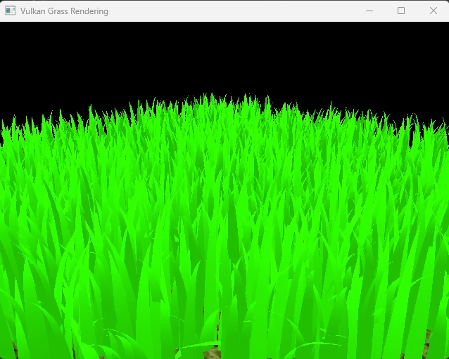

Vulkan Grass Rendering
==================================

**University of Pennsylvania, CIS 565: GPU Programming and Architecture, Project 5**

* Yue Zhang
  * [LinkedIn](https://www.linkedin.com/in/yuezhang027/), [personal website](https://yuezhanggame.com/).
* Tested on: Windows 11, i9-13900H @ 2.60GHz 32GB, NVIDIA GeForce RTX 4070 Laptop 8GB (Personal Laptop)
* Compute capability: 8.9

## Project View
This is a project implementing this paper: [Responsive Real-Time Grass Rendering for General 3D Scenes](https://www.cg.tuwien.ac.at/research/publications/2017/JAHRMANN-2017-RRTG/JAHRMANN-2017-RRTG-draft.pdf) in Vulkan to generate a vivid grass simulation.

This is the screenshot and recording for grass renderer with all features and default setting:

## Features
Here are the features implemented:
* Compute shader
  * Force simulation
    * Gravity
    * Recovery force
    * Wind
  * Culling tests
    * Orientation test
    * View frustum test
    * Distance test
* Grass pipeline stages
  * Vertex shader: do model transformation
  * Tessellation control shader: control tessellation level
    * Tessellation level based on distance
  * Tessellation evaluation shader: eveluate shape of grass blade based on bezier curve
  * Fragment shader: use phong shading to calculate the final color of grass
* Vulkan setups: add descriptor set layout for the compute shader and the grass vertex shader, update the descriptor sets and record command buffers. Bascially learning the complicated APIs.

### Tessellation level based on distance

### Force Simulation

### Culling tests

## Performance Analysis
### Different numbers of grass blades

### Improvement from culling

