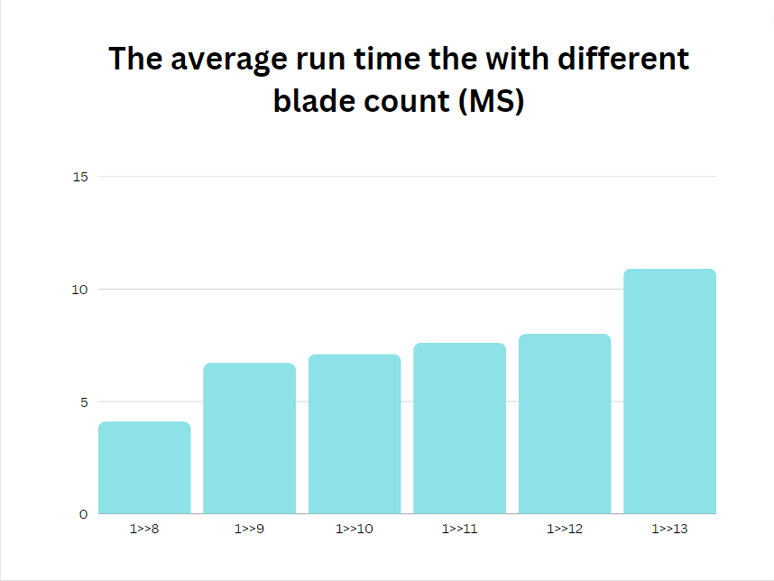
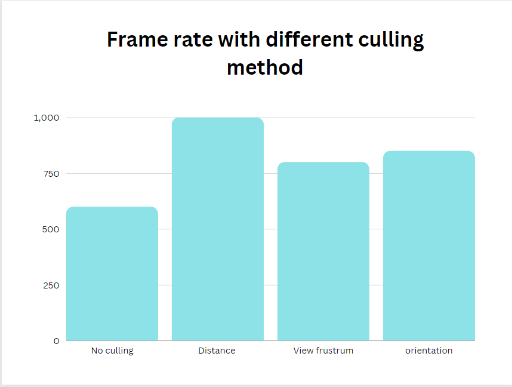

Vulkan Grass Rendering
==================================

**University of Pennsylvania, CIS 565: GPU Programming and Architecture, Project 5**

* Han Wang

* Tested on: Windows 11, 11th Gen Intel(R) Core(TM) i9-11900H @ 2.50GHz  22GB, GTX 3070 Laptop GPU

## Summery

This project involves the creation of a grass rendering system built on the foundation of Vulkan. The primary tasks encompass three essential components: The rendering pipeline, compute shader and grass simulation. The rendering pipeline follows the standard Vulkan structure, progressing through the vertex shader, tessellation control shader, primitive generator, tessellation evaluation shader, geometry shader, and finally the fragment shader. In our pursuit of enhancing rendering efficiency, particularly when dealing with the complex demands of rendering grass, I strategically prioritized the implementation of the compute shader ahead of the fragment shader. Furthermore, I incorporated a sophisticated culling system designed to eliminate unnecessary computations in areas not visible, thereby significantly improving both efficiency and performance. This culling system comprises distance culling, view-frustum culling, and orientation culling.

## Analysis

Based on the output I got, I tested the different numbers of blades and their run time on the rendering part and got the following graph:

Analyzing the above graph, it becomes readily apparent that a direct correlation exists between the number of blades to be drawn and the computational time required for these calculations. As the quantity of blades in the scene increases, the overall runtime is expected to exhibit an uptick. It's worth noting, though, that this increment is not particularly substantial, primarily due to the inherent parallel nature of the processes involved. In other words, the scaling of runtime with blade count, while observable, is moderated by the parallelism in the system, resulting in a relatively minor impact on overall performance.

Also, since I've implemented all three different culling methods, I tried to implement them separately and get the following graph:

]

The graph presented above offers a clear visual representation of discernible variations in frames per second (FPS) performance across three distinct culling methodologies. In my analysis, I believe that the primary factor contributing to potential FPS improvements with culling lies in the optimization of the rendering process, specifically in reducing the number of grass blades that necessitate rendering.

These three culling methods diverge in their efficacy based on their respective capabilities to cull out portions of the grass scene. Essentially, the essence of their distinction is rooted in how effectively each method can eliminate or exclude certain grass blades from the rendering pipeline. The underlying principle is straightforward: the fewer grass blades that must be processed and rendered, the greater the potential increase in FPS, resulting in a more responsive and smoother visual experience for the user.
