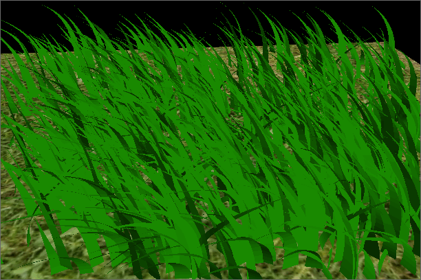

Vulkan Grass Rendering
==================================

**University of Pennsylvania, CIS 565: GPU Programming and Architecture, Project 4**

* Xiaoyue Ma
  * [LinkedIn](https://www.linkedin.com/in/xiaoyue-ma-6b268b193/)
* Tested on: Windows 10, i7-12700H @ 2.30 GHz 16GB, GTX3060 8GB

# Overview

In this project, I developed a grass simulator and renderer using the Vulkan API, drawing inspiration from the paper [Responsive Real-Time Grass Rendering for General 3D Scenes](https://www.cg.tuwien.ac.at/research/publications/2017/JAHRMANN-2017-RRTG/JAHRMANN-2017-RRTG-draft.pdf). The simulation represents each grass blade with three control points: v0, v1, and v2, facilitating efficient tessellation. The core components encompass a vertex shader for Bezier control point transformations, tessellation shaders for grass geometry generation, and a fragment shader for grass blade shading.   



# Table of Contents  
* [Features](#features)  
	* [Physical Force](#force)
	* [Blades Culling](#culling)
	* [LOD Tessellation](#lod)
* [Performance Analysis](#performance)   


# <a name="features"> Features</a>
## <a name="force">Physical Force</a>
In our project, grass blades are represented using Bezier curves with three control points: `v0` indicating the blade's position on the geometry, `v1` serving as an upward vector guide above `v0`, and `v2` acting as a directional guide. We simulate forces on these blades while they remain as Bezier curves, primarily applying transformations to `v2` and subsequently adjusting `v1` to ensure the blade's consistent length.  


### Gravity
Using a specified gravity direction, `D.xyz`, and acceleration magnitude, `D.w`, the environmental gravity `gE`, is calculated as `gE = normalize(D.xyz) * D.w`. The front-facing gravity influence on the blade, termed "front gravity", is `gF = (1/4) * ||gE|| * f`. The overall gravity acting on the grass blade is then `g = gE + gF`.

### Recovery
The recovery force, bringing the grass blade back to equilibrium, is based on Hooke's law. It compares the current position of `v2` with its initial position, `iv2`, set at the simulation's start. Initially, `v1` and `v2` are aligned at the blade height along the up vector. The recovery forces are then calculated as `r = (iv2 - v2) * stiffness`.

### Wind
The wind's direction in the simulation is dynamic, defined by `windFunc (vec3(2.0, 4.0, 2.0) * sin(totalTime * 0.1))`. Grass blades aligned with the wind direction experience a greater impact, represented by the windAlignment term. The cumulative wind force, `w`, is given by `windDirection * windAlignment`.

### Result


## <a name="culling">Blades Culling</a>
### Orientation

When the grass blade's front face direction is perpendicular to the view vector, it can cause aliasing artifacts due to the blades having no width and appearing smaller than a pixel. To address this, blades are culled using a dot product test checking for perpendicularity between the view vector and the blade's direction. The threshold for this culling is set at `0.9`.

### View-Frustum
  
Blades outside the view-frustum are culled since they won't be visible in the frame. To ascertain a grass blade's position in relation to the view-frustum, three points: `v0`, `v2`, and `m = (1/4)v0 * (1/2)v1 * (1/4)v2)` are assessed. If all these points lie outside the view-frustum, the blade is culled.

### Distance

For grass blades at significant distances that appear smaller than a pixel, rendering can introduce artifacts. To counter this, blades are culled based on their distance from the camera, similar to orientation culling.

### Result


### <a name="lod">LOD Tessellation</a>

To optimize performance, the tessellation level for a grass blade can be adjusted based on its distance from the camera. Blades farther away require less detail, reducing the need for high tessellation levels.

```
#if DYNAMIC_LOD
    if (dist > 20.0)
    	LOD = 4;
    else if (dist > 15.0)
    	LOD = 8;
    else if (dist > 10.0)
    	LOD = 12;
    else if (dist > 5.0)
    	LOD = 16;
#endif
```
#### Result


# <a name="performance">Performance Analysis</a>
View-frustum culling offers a minor performance enhancement, as it primarily culls blades at the image's periphery. Distance culling and Orientation culling is more effective based on the camera position. Dynamic LOD significantly improves performance by reducing polygons for distant grass blades. Most rear blades are obscured, and reduced tessellation often goes unnoticed, yielding a substantial speed increase with minimal visual impact.

Utilizing all culling methods amplifies the frame rate to almost 10 times the original. These methods substantially enhance performance while minimally affecting visual quality.

<p align="center">
  
</p> 

