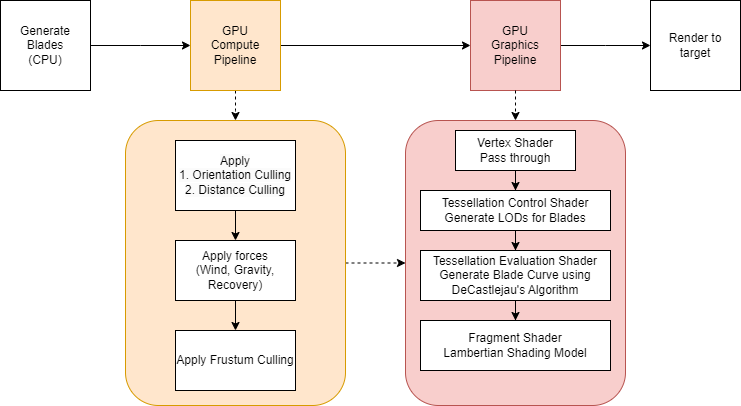
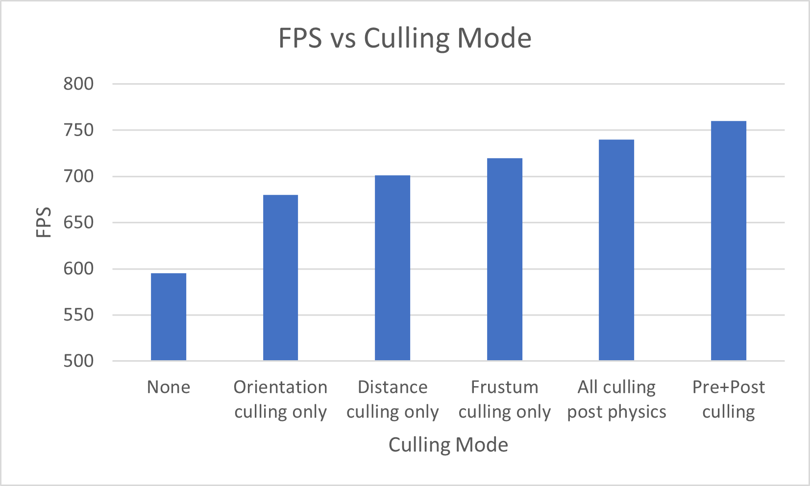
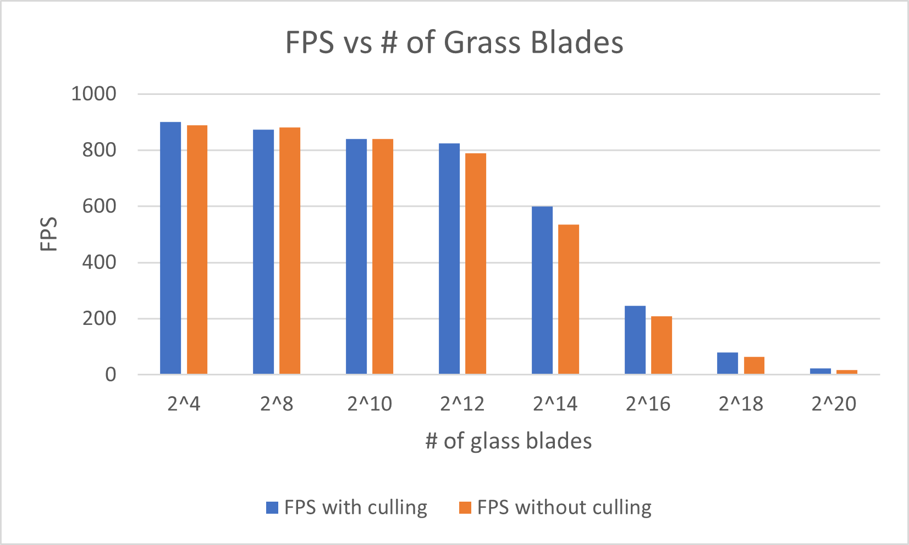

Vulkan Grass Rendering
==================================

**University of Pennsylvania, CIS 565: GPU Programming and Architecture, Project 4**

* Utkarsh Dwivedi
  * [LinkedIn](https://www.linkedin.com/in/udwivedi/), [personal website](https://utkarshdwivedi.com/)
* Tested on: Windows 11 Home, AMD Ryzen 7 5800H @ 3.2GHz 16 GB, Nvidia GeForce RTX 3060 Laptop GPU 6 GB

## Introduction

This is a Vulkan based grass renderer heavily based on the paper [Responsive Real-Time Grass Rendering for General 3D Scenes](https://www.cg.tuwien.ac.at/research/publications/2017/JAHRMANN-2017-RRTG/JAHRMANN-2017-RRTG-draft.pdf). It also draws inspiration from certain elements of [Ghost of Tsushima's procedural grass rendering pipeline](https://www.youtube.com/watch?v=Ibe1JBF5i5Y).

## Overview

|Overview of the process|
|:-:|
||

### Representing a grass glade

A grass blade is represented according to the above image from the grass rendering paper. Each blade struct contains:
- `v0`: position on a **2D plane** where it should be placed,
- `v1`: control point for a Bezier curve (this idea is also employed in Ghost of Tsushima),
- `v2`: end point of the blade
- `up`: vector containing the up direction, in this case `[0,1,0]`, but this can easily be modified to by dynamic based on the ground plane
- `width`: the width of the blade,
- `height`: the *length* of the blade (the paper's terminology calls this the height, but I think length makes more sense),
- `direction`: an angle that represents the orientation of the blade around the up-vector

### Constructing a scene

The paper uses poisson-disk sampling to generate blade positions on the plane. Ghost of Tsushima's pipeline uses a grid of multiple `512x512` artist-authored textures to define which blade of grass should be placed in which areas. 

This project generates the positions using a simple random number generator, but the Ghost of Tsushima method is an interesting direction for the future.

### GPU compute pipeline

This is where the physical model for the grass blades is evaluated and grass blades are culled.

First, orientation and distance culling is applied as described in the paper. Orientation culling culls out blades that are parallel to the view vector, and distance culling culls out increasing number of blades by putting them in buckets of distance from the camera.

|Orientation culling|Distance culling|
|:-:|:-:|
|||

Next, physical forces are evaluated (wind and gravity). The wind force is a simple 2D perlin noise, similar to the way Ghost of Tsushima handles wind.

|Perlin noise based wind|
|:-:|
||

A recovery force is applied based on a stiffness coefficient to return the grass blade to its initial pose. This uses Hooke's Law of elasticity to calculate the blade's position.

`(initial pose - updated pose) * stiffness coefficient`

Applying these forces could lead to invalid configurations for `v2`, the tip of the blade. This is corrected by clamping its position to always be above the ground plane. A final correction is applied to maintain the length of the blade by adjusting v1 and v2.

Finally, frustum culling is applied to cull out blades that do not lie in the frustum and user-defined near and far clip planes. In the below image, the size of the frustum is *very slightly* reduced to show the effect of blades outside the frustum being culled.

|Frustum culling|
|:-:|
||

The blades that remain after culling are sent to the graphics pipeline to be tessellated.

### GPU graphics pipeline

**Vertex Shader**

The vertex shader is a simple pass-through shader that passes information on to the tessellation control shader after converting world-space positions to camera-space positions.

**Tessellation Control Shader**

The tessellation control shader defines the tessellation levels (blade LODs) on a grass blade based on the distance of the blade from the camera.

|Blade LODs based on distance from camera|
|:-:|
||

**Tessellation Evaluation Shader**

The tessellation evaluation shader does the actual tessellation of the vertices. This is done using the DeCastlejau algorithm to evaluate each vertex's position on along bezier curve and thickness value. Refer the paper for more details.

**Fragment Shader**

The fragment shader applies a simple lambertian shading model to colour the grass blades.

## Performance Analysis

For performance analysis, a scene resolution of 1280x720 was used.

### Culling

For analysing culling, the number of grass blades in the scene was kept at **213**.

|Frame rate at different culling strategies|
|:-:|
||

This is pretty expected. Each culling method is slightly more advanced and improves performance individually. When all culling is applied after physics calculations, the performance gain is improved further. Changing this to applying **orientation** and **distance** culling before computing physics, and only applying the **frustum** culling after computing physics, similar to Ghost of Tsushima, has an further improved performance. This has potential of improvement by implementing occlusion culling, which would really start showing its potential with very high blade counts.

### Varying blade counts

For analysing FPS with increasing number of grass blades, no culling was tested against "pre+post" culling.

|Frame rate at increasing blade counts|
|:-:|
||

The frame rate really starts to take a hit once the blade count increases logarithmically beyond a very small number. This is expected, and this is exactly where strategies like occlusion culling, grid based binning, etc. will help.

## References

- [Responsive Real-Time Grass Rendering for General 3D Scenes](https://www.cg.tuwien.ac.at/research/publications/2017/JAHRMANN-2017-RRTG/JAHRMANN-2017-RRTG-draft.pdf)
- [Sucker Punch Productions, Ghost of Tsushima's procedural grass rendering pipeline talk](https://www.youtube.com/watch?v=Ibe1JBF5i5Y)